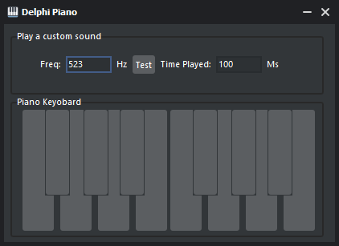

# 🎹 Delphi Musical Keyboard

  

A modern, minimalist virtual piano keyboard built with Delphi

## Features

* Interactive virtual keyboard with 14 keys spanning C to C#
* Custom frequency input for sound experimentation
* Adjustable note duration
* Native Windows sound integration via WinBeep API

## Quick Start

1. Download the latest release
2. Launch the application
3. Play music using your keyboard or mouse

## Technical Details

* Built with Delphi
* Uses Windows Beep API (kernel32.dll)
* Frequency range: 262 Hz - 554 Hz
* Configurable note duration

## Note Frequencies

| Note | Frequency (Hz) |
|------|---------------|
| C    | 262          |
| C#   | 277          |
| D    | 294          |
| D#   | 311          |
| E    | 330          |
| F    | 349          |
| F#   | 370          |
| G    | 392          |
| G#   | 415          |
| A    | 440          |
| A#   | 466          |
| B    | 494          |
| C    | 523          |
| C#   | 554          |

## Requirements

* Windows operating system
* Sound output device
* Delphi IDE (for compilation)

Limitations

Basic beep sound quality
Windows-only compatibility
Limited to single octave plus two notes

Contributing
Contributions are welcome:

Report bugs
Suggest features
Submit pull requests

Support
Need help? Open an issue in the repository!
License
Free to use and modify for your projects.

Made with ❤️ using Delphi

